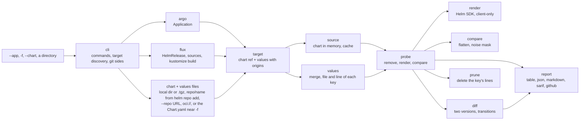

# deadvalues — design

How deadvalues works inside and why it was built this way. How to use it is in the [README](README.md) and [`docs/`](docs/); the command and flag reference is in [`docs/cli/`](docs/cli/deadvalues.md).

---

## 1. The problem

Helm **silently ignores** any key the chart does not read. That is dangerous in GitOps with Renovate:

```
Renovate bumps the chart 0.46 → 0.47
The chart renamed storage.data.labels → persistence.labels
Your values.yaml still has storage.data.labels
Helm does not complain, Argo syncs green, CI passes
The Longhorn backup label is gone → backups stop running
Nobody notices until a restore is needed
```

The existing tools (`helm-unused-values` and similar) run regexes over the templates. They fail with `toYaml .Values.x`, `range`, `tpl`, `include` and subcharts. deadvalues does not read the templates: it **renders the chart and observes the result**. Whatever the templates do, a key that changes nothing in the output has no effect.

---

## 2. Architecture



The pipeline has one shape for every command:

1. **Resolve** the input into *targets*. A target is a chart reference plus the merged values, where every key remembers the file, line and YAML document it came from. Everything after the target is shared; only this step depends on the input:

   | Input | Target |
   |---|---|
   | `--app` | the Argo or Flux reader (`internal/argo`, `internal/flux`) reads the manifest: one target per Helm source of an Application, or per HelmRelease in the file |
   | `--chart` + `-f` | built directly from the chart and the files, no reader. The chart is a local directory or `.tgz`, a `helm repo add` name (`repo/name`), a name with `--repo URL`, or `oci://` |
   | `-f` alone | the readers of every Application and HelmRelease in the repository that loads the file; if none does, the nearest `Chart.yaml` |
   | a directory (`scan`, `diff`) | the readers of every Application and HelmRelease in it, kustomize overlays built first |
2. **Load** the chart (`internal/source`): local directory or `.tgz`, HTTP repository, OCI, or a `helm repo add` name, into memory.
3. **Probe** (`internal/probe`): render the chart with the values, remove keys, render again, compare (section 3).
4. **Report** (`internal/report`), or **prune** (`internal/prune`) using the origins of step 1, or **diff** (`internal/diff`) by probing two chart versions.

`internal/cli` holds the commands and everything that is not analysis: finding the targets in a directory or a repository, extracting git revisions, applying `.deadvalues.yaml`, writing reports.

---

## 3. The algorithm

```
                   ┌───────────────────────────────┐
 values.yaml ─────▶│ 1. render BASE (2x)           │──▶ noise mask
 chart ───────────▶│                               │
                   └───────────────┬───────────────┘
                                   ▼
                   ┌───────────────────────────────┐
                   │ 2. for each subtree:          │
                   │    remove → render → compare  │◀── bisection
                   └───────────────┬───────────────┘
                                   ▼
                   ┌───────────────────────────────┐
                   │ 3. keys without effect:       │
                   │    equal to the default?      │
                   │    sentinel test              │
                   │    condition tests            │
                   └───────────────┬───────────────┘
                                   ▼
                                report
```

**1. Base render and noise mask.** The chart is rendered with the full values **twice**. Fields that differ between the two renders (`randAlphaNum`, `now`, `genCA`, checksum annotations) go into a mask and are ignored in every later comparison. Without it, every key would look alive.

**2. Normalization.** Each manifest is split with Helm's own `releaseutil.SplitManifests`, and each object is indexed by `Kind/namespace/name`, not by template file. Every field becomes a flattened path:
```
Deployment/apps/web:.spec.strategy.type = "Recreate"
```
So the comparison does not break if a chart moves a resource to another template. `NOTES.txt` and partials are not part of the output.

**3. Removal with bisection.** For each top-level key:
```
remove the whole subtree → render → compare with BASE
├─ same     → no key inside has an effect → classify them all at once (1 render)
└─ changed  → a map? go one level down and repeat for each child
              a leaf? → ALIVE
```
A whole branch without effect costs one render to find, so a large block of dead or redundant keys is not probed key by key; only the keys found without effect get the extra tests of step 4. Renders run in parallel (worker pool) on a chart cloned in memory for each render.

If removing a map changes the output but no child alone does (`{{ if or .a .b }}`), the map is `GROUP`, and its children are not reported dead. If removing a key breaks the render (`required`, schema), it is `ERROR`: required, therefore alive.

**4. Classifying the keys without effect.** Removing the key changed nothing. Why?

| Test | Meaning | Status |
|---|---|---|
| Your value equals the default in the chart's `values.yaml` (or is `null` with no default) | The default already does the same | `REDUNDANT` |
| A **sentinel** value (another string, `!bool`, number+7919, an empty or one-item list) changes the output | The chart reads the key; your value matches a fallback in the template (`default "X" .Values.y`) | `REDUNDANT (implicit)` |
| Turning on a disabled `enabled` flag (next to the key, on an ancestor, or any `*.enabled: false` the user set) makes the key matter | The key only matters with the feature on | `CONDITIONAL` |
| Declaring an API the chart checks with `.Capabilities.APIVersions.Has` makes the key matter | The key only matters when the cluster serves that API | `CONDITIONAL` |
| None of the above | The chart does not read the key | `DEAD` |

The `enabled` test also tries every `*.enabled: false` the user set, not only the flags on the key's path: in kube-prometheus-stack, `defaultRules.rules.etcd` is gated by `kubeEtcd.enabled`, which is elsewhere in the tree. The statuses as users see them are in the [README](README.md#statuses).

---

## 4. Targets and values

### Origins

Every key carries its origins: the file, line and document it came from, and the prefix it lives under (`spec.values` in a HelmRelease). Several files can set the same key; the origins keep them all, in merge order. They make three things possible: annotations on the exact line, `prune` editing the right lines of the right document, and judging a file that several apps share.

### Values files shared by several apps

A `global-values.yaml` loaded by ten charts is dead in some and alive in others. A key of such a file is only reported when **no** app that loads it uses it. This is why:

- `-f <file>` alone finds every Application and HelmRelease in the repository that loads the file (or, failing that, the nearest `Chart.yaml`), analyzes all of them and reports only that file's keys.
- `check --app` sees one app, so it cannot decide: keys from a file other apps load are `SHARED`, never fail, and point to `scan`.
- `prune` removes a key from a file only when every analyzed app that loads the file agrees. `prune --app` never edits a file another app loads; it points to `prune -f <file>`.

"Other apps" means the whole repository, Argo CD and Flux, with the same resolution as `-f`, so apps spread over `apps/`, `clusters/` or `bootstrap/` are found. Values embedded in a manifest (a HelmRelease's `spec.values`) are never shared: two HelmReleases in one file have separate blocks.

### Charts in memory

A chart is downloaded once into memory (`loader.LoadArchive`) and **cloned** for each render, copying only what dependency processing mutates (values, dependency metadata, the subchart list). Parsing the chart for every render cost n8n 9s; cloning made it 0.5s. Remote charts are cached as `.tgz` on disk, keyed by repository path, chart and version.

---

## 5. `diff` and git

`diff` probes the same values against two chart versions and compares the status of every key (`BREAKING`, `PINNED`, `CHANGED`, `FIXED`). The versions can be given (`--from`/`--to`) or come from git:

| Flags | Before | After |
|---|---|---|
| `--base X` | manifests at `X` | the working tree (in CI, the pull request) |
| `--head Y` | the commit `Y` branched from | manifests at `Y` |
| `--base X --head Y` | `X` | `Y` |

- The names follow GitHub's pull request terms: `base` receives, `head` brings the changes. Without `--base`, the fork point is the merge-base of `--head` with the default branch (`origin/HEAD`, else `origin/main` or `origin/master`), as in a pull request.
- Both sides are extracted with `git archive` into temporary directories, so the working tree is never touched and a branch can be reviewed without checking it out.
- The values of the "after" side are used for both versions: the question is what the new chart does to the values you are about to ship.
- A ref missing locally is looked up on `origin` (`renovate/x` finds `origin/renovate/x`). If most versions go down, a note warns that the sides were probably swapped.

**By directory.** Renovate bumps the version in different places: an Application's `targetRevision`, a HelmRelease `version`, an `OCIRepository` tag in another file, an overlay patch. Instead of handling each, `diff <dir>` resolves the targets of the directory in both trees, pairs them by identity (Application + source, or HelmRelease namespace/name) and diffs only those whose chart version changed. `-f` alone does the same for the apps that load the file.

---

## 6. Flux

The Flux reader produces the same target as the Argo one. The field-by-field rules are in [`docs/argo-flux.md`](docs/argo-flux.md); the design points are:

- **Two reading modes.** Flux repositories keep the HelmRelease in `apps/base/` and patch it per environment, so reading the base file gives the wrong version and values. A directory with a `kustomization.yaml` is built in process with `krusty`, the kustomize library Flux uses, and the HelmReleases, sources and ConfigMaps are read from the result. Without one, files are read as they are.
- **Origins through the build.** After a build, a key still points to the file and line that set it: the HelmReleases and patches that take part in the build are indexed, and each key lists the files that set it in kustomize order (base first, overlay last).
- **Resolving names.** Sources and ConfigMaps are found by name. When several match (`clusters/staging` and `clusters/production` both have a `podinfo` HelmRepository), a `configMapGenerator` ConfigMap wins, then the same namespace, then the object whose directory shares the longest prefix with the HelmRelease.
- **`prune` on a HelmRelease.** `spec.values` lives inside the manifest, and Flux files often hold an `OCIRepository` and a `HelmRelease` together, so origins keep the document and the `spec.values` prefix, and `prune` removes only that key's lines in that document. Keys from a `configMapGenerator` file are removed from that file; inline ConfigMap `data` and Secrets are not edited.
- **What stays outside.** `${var}` placeholders are left as text unless `.deadvalues.yaml` gives them values; SOPS-encrypted Secrets are skipped with a note; the Flux `Kustomization` objects in `clusters/<name>` are not followed, because some of their sources (`ExternalArtifact`) only exist in the cluster.

---

## 7. Outputs

- **One analysis, several writers.** Every format is written from the same result. `--output-file FORMAT=FILE` adds a report without replacing stdout, so CI gets Markdown for the pull request, SARIF for code scanning and the table in the log from one run.
- **`--output-file` exists because of PowerShell.** `>` decodes the output of other programs with the console code page and corrupts UTF-8 (`—` becomes `ÔÇö`). deadvalues writes the file itself, always UTF-8 and uncolored.
- **Exact lines.** The values are parsed twice: into a `map` for Helm and as `yaml.v3` nodes for positions. `github` annotations and SARIF point to the line of the key.
- **Markdown without emoji.** Statuses are plain text and the ones that fail by default (`DEAD`, `BREAKING`) are bold. Color belongs to whatever shows the report; the GitHub Action adds a GitHub alert on top.
- **Relative paths.** Every output, JSON included, uses paths relative to the current directory.
- **The banner** shows only on a terminal: anything piped (CI, scripts) gets plain output, and `version` prints lines a script can parse.
- **Exit codes** are the contract for CI: `0` nothing at the fail-on level, `1` findings, `2` the analysis could not run.

---

## 8. GitHub Actions

Two composite actions in this repository: `guarnz/deadvalues@v0` (`action.yml`) runs deadvalues and reports; `guarnz/deadvalues/setup@v0` (`setup/action.yml`) only installs it. Both run `scripts/action-install.sh`, which downloads the release **binary** for the runner and checks it against `checksums.txt`: faster than pulling the image, and no Docker needed. `setup` is a subdirectory of the same repository, like `actions/cache/restore`, so both share the tag and the install script.

**The base is the change itself.** On `pull_request` it is `pull_request.base.sha`: the checkout is the merge commit, so the diff is exactly what the pull request changes. On `push` it is `github.event.before`: every commit of the push. A `base` input overrides both. When there is none (first push of a branch, force push, `workflow_dispatch`), every app is scanned and the report says why.

**`mode: all` runs two commands** because they catch different changes: `diff --base` what a chart bump does to the values (Renovate), `scan --changed-since` dead keys in the apps whose files changed (someone edited a values file). A pull request usually has findings in only one, so commands without findings are hidden.

**Two fail-on inputs**, because the commands accept different levels: `fail-on-diff` (`breaking` by default) and `fail-on-scan` (`none` by default). A scan of a changed app also reports keys that were dead before the change; failing on them would block a Renovate pull request for old problems.

**`args`** runs any deadvalues command with the same report. It is split with `read -ra`, never `eval`, so a value built from pull request data cannot run shell code.

**The report** opens with a GitHub alert (`CAUTION`, `WARNING`, `NOTE`), lists every command with :x:/:warning:/:white_check_mark: and shows the sections with findings. Which commands have findings is read from the **JSON** report with `jq`: the JSON is a stable contract, the Markdown is not. The pull request comment is found by a hidden marker and updated in place; above ~60 KB it is cut with a link to the job summary, because GitHub rejects comments over 65 KB. The run step always exits 0 and a last step fails the job, so the comment is posted even when the check fails.

```
Pull request (Renovate: webapp 0.1.0 → 0.2.0)
        │  base = pull_request.base.sha
        ├─▶ deadvalues diff . --base <sha>             labels.team ALIVE → DEAD: BREAKING
        └─▶ deadvalues scan . --changed-since <sha>    report only
        ▼
CAUTION alert, comment updated, job fails → Renovate does not automerge
```

Inputs, outputs and the report format are in [`docs/github-action.md`](docs/github-action.md).

---

## 9. Distribution

| Form | How |
|---|---|
| CLI | GoReleaser binaries (linux/darwin/windows, amd64/arm64) |
| Helm plugin | `helm plugin install https://github.com/guarnz/deadvalues`; the install hook downloads the release binary |
| Image | `ghcr.io/guarnz/deadvalues`, multi-arch, signed with cosign |
| GitHub Actions | section 8 |

Supply chain: actions pinned by digest, OpenSSF Scorecard, Renovate, govulncheck and CodeQL, releases signed with an SBOM.

---

## 10. Code layout

```
deadvalues/
├── cmd/deadvalues/main.go       entrypoint
├── internal/
│   ├── cli/                     cobra commands, target discovery, git sides, outputs
│   ├── config/                  .deadvalues.yaml
│   ├── source/                  charts: dir, tgz, HTTP repo, OCI, repo/name, cache
│   ├── argo/                    Application → targets
│   ├── flux/                    HelmRelease and its sources → targets; kustomize build
│   ├── values/                  merge, origins, line positions (yaml.v3)
│   ├── render/                  Helm SDK client-only, capabilities
│   ├── compare/                 flattening, noise mask, equality
│   ├── probe/                   removal, bisection, sentinel, conditions, worker pool
│   ├── diff/                    two probes → transitions
│   ├── prune/                   removes keys, line by line
│   ├── report/                  table, json, markdown, sarif, github
│   └── tools/gendocs/           generates docs/cli from the cobra commands
├── action.yml                   GitHub Action: built-in flow or args
├── setup/action.yml             GitHub Action: install only
├── scripts/                     action install and run, Helm plugin install hook
├── docs/                        user documentation; docs/cli is generated
├── plugin.yaml                  Helm plugin manifest
├── Dockerfile
├── .goreleaser.yaml
└── testdata/                    charts, values, a Flux repository, golden files
```

---

## 11. Tests

- **Synthetic charts.** `testdata/charts/cases` covers every case in one chart: dead key, typo, template fallback, `toYaml`, `range`, `tpl`, `if or` (group), disabled feature, `randAlphaNum` (noise), subchart with `condition`, `required`, `.Capabilities.APIVersions.Has`. `cases-v2` is its next version, for `diff`.
- **Golden files** for the outputs (`go test ./internal/cli -run Golden -update` rewrites them).
- **Pinned real charts**: vaultwarden and n8n, as regression tests and a benchmark.
- **Flux**: a synthetic repository in `testdata/flux` (base + staging/production overlays, `configMapGenerator`, a SOPS Secret, `targetPath`, `optional`).
- **`diff` by directory**: a temporary git repository and a local Helm repository served by a test HTTP server.
- **What CI relies on**: `github` annotations, the `diff` Markdown, `scan --changed-since` and a target that cannot be analyzed.
- **CLI reference**: CI regenerates `docs/cli` and fails if it changed.
- **Fuzzing**: `FuzzAddYAML` feeds arbitrary YAML to the values parser, which must never panic and must keep an origin for every key; `go test` runs its seeds, `go test ./internal/values -fuzz FuzzAddYAML` fuzzes it.
- **Action scripts**: `action-run.sh` was tested by hand against a temporary git repository and a local Helm repository, for every mode, event and `args` case; there is no automated test yet. `shellcheck` is clean.

---

## 12. Decisions made while building

| Topic | Decision |
|---|---|
| Chart in memory | Loaded once and cloned per render (section 4). n8n went from 9s to 0.5s |
| Splitting YAML documents | Helm's own `releaseutil.SplitManifests`; a custom regex broke on cert-manager |
| `CONDITIONAL` | Tries every `*.enabled: false` the user set, not only those on the key's path |
| Shared values | A key of a file several charts load is dead only if none uses it (section 4) |
| Warnings | `lookup` warns only when there are `DEAD` keys. API-dependent keys are `CONDITIONAL` naming the API, with a note pointing to `apiVersions` |
| `--kube-version` | The Helm SDK default, not a fixed version |
| Helm 4 SDK | The same engine as current Argo CD and Flux; reads `v1` and `v2` charts |
| `prune` | Deletes only the key's lines, so everything else is kept byte for byte; flow-style maps (`{a: 1}`) fall back to editing through the AST |
| GitHub Action | Downloads the binary instead of using the image (section 8) |
| CLI reference | Generated from the cobra commands and checked in CI, instead of being copied into the docs |

---

## 13. Validation

**A real Argo CD repository** (the author's homelab, 24 Helm sources, 26s):
- **postgres**: `cluster.bootstrap.initdb.*` and `cluster.backup.retentionPolicy` do not exist in the `cluster` chart (the right keys are `cluster.initdb.*` and `backups.retentionPolicy`). The effective retention was the default (30d), not 7d.
- **longhorn**: `longhornUI.resources` and `longhornDriver.resources` are not read by any template of chart 1.12.1.
- **n8n**: `strategy.rollingUpdate: null` has no effect with `type: Recreate`; 8 keys equal to the default.
- **kube-prometheus-stack**: 5 `defaultRules.rules.*` conditional on `kube*.enabled: false`; 24 keys equal to the default.
- **loki**: `monitoring.serviceMonitor.enabled` has no effect offline because the chart requires `monitoring.coreos.com/v1/ServiceMonitor`; with `apiVersions` in the config it becomes `ALIVE`.
- `diff` of vaultwarden 0.46.2 → 0.40.0 found `storage.data.labels` `BREAKING`, the scenario of section 1; `diff <apps> --base HEAD~5` found the real Renovate bumps (kube-prometheus-stack 91.4.0 → 91.4.1, vaultwarden 0.46.1 → 0.46.2 with `image.tag` `CHANGED`).

**`fluxcd/flux2-kustomize-helm-example`**: `scan apps` found and built the staging and production overlays; `version: ">=1.0.0"` resolved to podinfo 6.15.0; an `OCIRepository` with `semver: "1.x"` resolved to cert-manager v1.21.2 from the registry tags.

---

## 14. Limitations and not supported yet

Consequences of rendering offline, also listed for users in [`docs/how-it-works.md`](docs/how-it-works.md#limitations):

| Limitation | Why |
|---|---|
| Keys read only through `lookup` can look dead | `lookup` returns nothing without a cluster; deadvalues warns when the chart uses it |
| Keys read only in `NOTES.txt` are `DEAD` | on purpose: they do not reach the cluster |
| `if or .a .b` with `a` and `b` in different maps shows up as `DEAD` | `GROUP` only covers keys of the same map |
| A key gated by something other than an `enabled` flag (`rollingUpdate` with `type: Recreate`) is `DEAD` | correct for the current values |
| `apiVersion: v3` charts fail | the Helm SDK does not support them in its public API yet |

Not supported yet:

| Item | Today |
|---|---|
| Following Flux `Kustomization` objects from `clusters/<name>` when the source is this repository, with their `postBuild` substitutions | point `scan` at the app directories; give `${var}` values in `flux.substitute` |
| Flux `chart.spec.valuesFiles` (values files inside the chart package) | a note says those keys are not taken into account |
| Argo CD `ApplicationSet` | not read |
| Flux charts from another git repository | an error |
| The GitHub Actions on Windows runners | the install script supports Linux and macOS and fails with a clear message |
