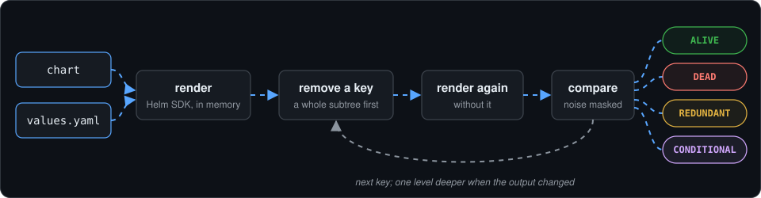

# How it works

deadvalues does not parse templates. It **renders the chart, removes each key you set, renders again and compares** the manifests:

1. Render the chart twice with your values. Fields that differ between the two renders (`randAlphaNum`, generated certificates, checksum annotations) are masked as noise.
2. Remove a subtree of your values and re-render. No change → every key under it is classified at once. Change → descend one level (bisection).
3. For keys whose removal changes nothing:
   - equal to the chart default → `REDUNDANT`
   - a different value changes the output → `REDUNDANT (implicit)`: your value matches a fallback in the template (`default "X" .Values.y`)
   - turning on a disabled `enabled` flag makes the key matter → `CONDITIONAL`
   - declaring an API the chart checks with `.Capabilities.APIVersions.Has` makes the key matter → `CONDITIONAL` on that API
   - otherwise → `DEAD`

Renders run in parallel, in memory, client-side (like `helm template`). Nothing touches a cluster.

## Charts

| `--chart` | Source |
|---|---|
| `./path`, `app-1.0.0.tgz` | a local directory or archive; a local path wins over a `repo/name` with the same spelling |
| `repo/name` | a repository from `helm repo add` (`repositories.yaml`, `HELM_REPOSITORY_CONFIG`), with its username and password |
| `name` with `--repo URL` | an HTTP repository: `index.yaml`, then the `.tgz` |
| `oci://...`, or `--repo oci://...` | an OCI registry, with the credentials of `helm registry login` |

Without `--version`, the latest chart is used; a range (`1.x`, `>=1.0.0`) picks the highest match. Remote charts are loaded in memory and cached as `.tgz` in the user cache directory (`~/.cache/deadvalues` on Linux), or `--cache-dir`; `--no-cache` always downloads.

## Values files without a chart (`-f` alone)

With `-f` and no `--app` or `--chart`, in `check`, `explain`, `prune` and `diff`:

1. Every Application and HelmRelease in the repository (git top level, or `--repo-root`) that loads the file is found: `valueFiles`, `configMapGenerator` files, or the manifest itself.
2. If none does, the nearest `Chart.yaml` in the file's directory or above it is used (the `ci/` values of a chart).
3. If nothing is found, the command fails and asks for `--chart` or `--app`.

Only the keys of the requested files are reported.

## Shared values files

A file several apps load, such as a `global-values.yaml`, is judged against all of them: a key is dead only if no app uses it. `-f` and `scan` apply this rule. `check --app` sees one app only, so it shows the keys of such a file as `SHARED` and points to `scan`; the search for the other apps covers the whole repository, Argo CD and Flux.

`prune` removes a key from a file only when every analyzed app that loads the file agrees it has no effect. `prune --app` never edits a values file that another app anywhere in the repository (Argo CD or Flux) also loads; it points you to `prune -f <file>`, which judges the file against all of them. Values embedded in a manifest, such as a HelmRelease's `spec.values`, belong to that release only.

`prune` deletes only the lines of the removed keys, so comments, ordering and formatting of everything else stay intact. A map left empty is removed too.

## `diff` and git

Both sides are extracted with `git archive`, so your working tree is never touched, and the values of the "after" side are used for both versions. If most versions go down, a note on stderr warns that the sides were probably swapped.

A ref that does not exist locally is looked up on `origin` (`--head renovate/example` finds `origin/renovate/example`); other remotes need the full name. In a fork, where `origin` is your copy, pass the real base explicitly, e.g. `--base upstream/main`.

It does not matter where the bump happened: an Application's `targetRevision`, a HelmRelease `version`, an `OCIRepository` tag or an overlay patch.

With `-f` alone, the comparison runs for every Application and HelmRelease that loads those values files. A values file that no manifest loads has no chart version in git; use `--chart` with `--from` and `--to` for it.

## Limitations

- `lookup` returns nothing offline, so keys read only through `lookup` can look dead. deadvalues warns when a chart uses it.
- Keys read only in `NOTES.txt` are reported as dead on purpose: they do not reach the cluster.
- `GROUP` covers keys that only matter together inside the same map; interactions across unrelated parts of the values can still show up as `DEAD`.
- `CONDITIONAL` detects `enabled`-style toggles; a key gated by another kind of switch (e.g. `strategy.rollingUpdate` with `type: Recreate`) is reported as `DEAD`, which is accurate for the current values.
- Charts that render resources only when the cluster serves an API (`.Capabilities.APIVersions.Has`) cannot know offline whether yours does: those keys are reported as `CONDITIONAL` on that API. See [configuration](configuration.md#api-versions).
